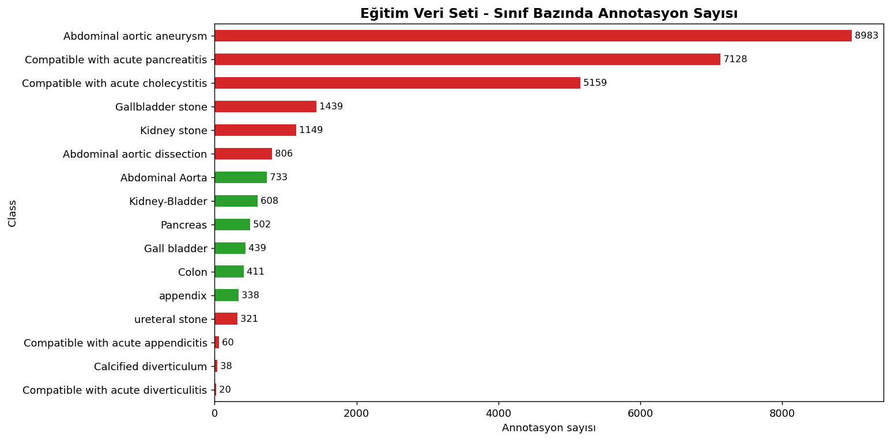
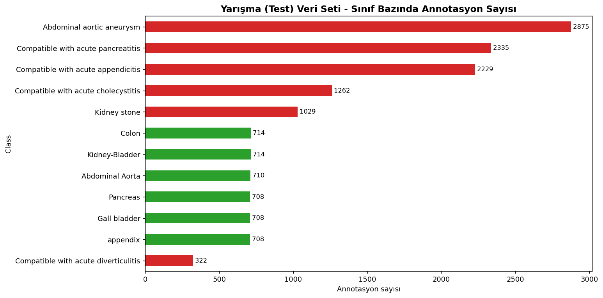
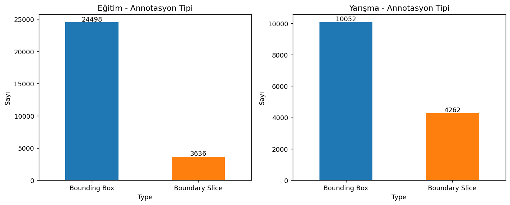
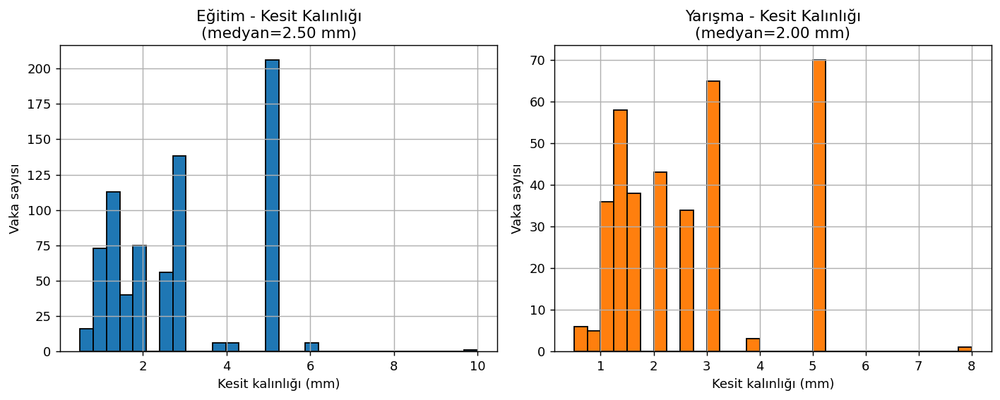
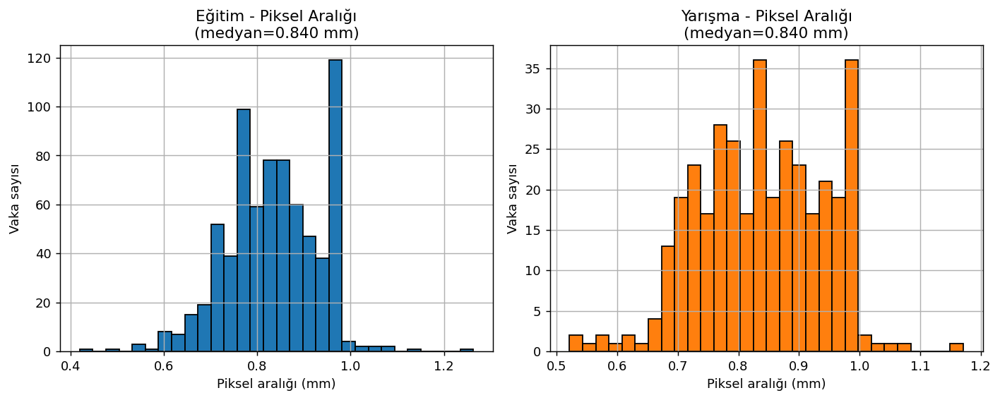
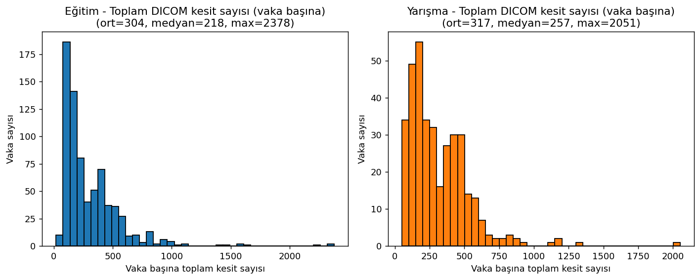
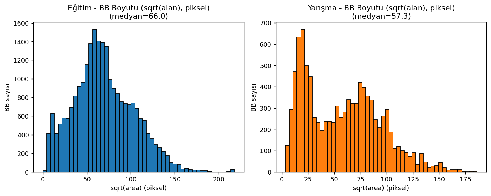
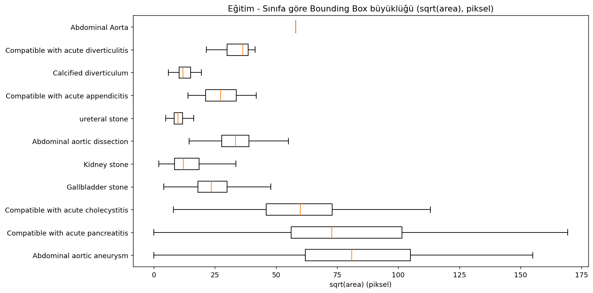
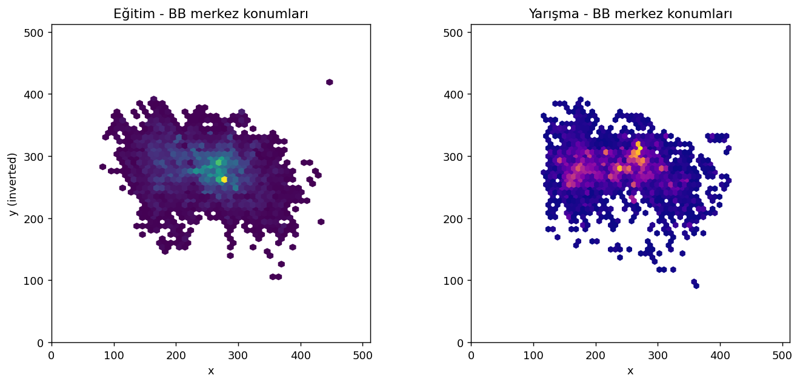
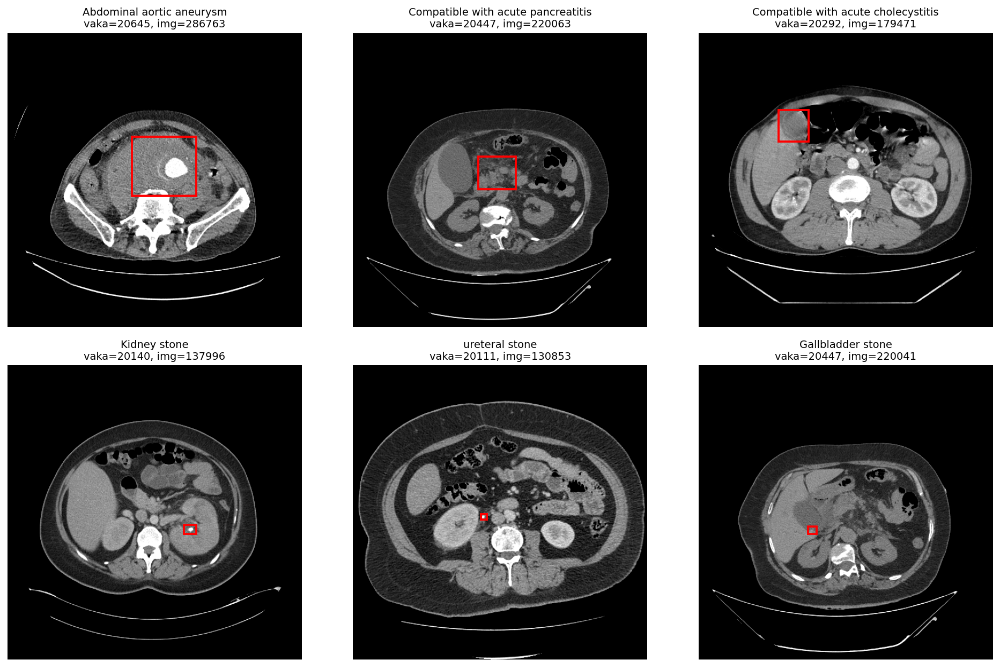

# TR_ABDOMEN_RAD_EMERGENCY Veri Seti — Kapsamlı Analiz Raporu

**Hazırlayan:** Claude (Cowork)  
**Tarih:** 17 Nisan 2026  
**Referans makale:** Koç U. ve ark., *Elevating healthcare through artificial intelligence: analyzing the abdominal emergencies data set (TR_ABDOMEN_RAD_EMERGENCY) at TEKNOFEST-2022*, European Radiology 34:3588–3597 (2024). DOI: 10.1007/s00330-023-10391-y

---

## 1. Yönetici Özeti

Bu veri seti, TEKNOFEST-2022 sağlıkta yapay zekâ yarışması kapsamında T.C. Sağlık Bakanlığı e-Nabız ve Ulusal Teleradyoloji Sistemi (UTS) altyapılarından türetilmiş, 459 hastanenin acil servis verilerinden derlenmiş, on deneyimli radyolog tarafından etiketlenmiş ve tam anonimleştirilmiş çok-sınıflı abdomen BT veri setidir. Ulaşılan dosyalarda iki ayrı alt küme bulunmaktadır:

* **Eğitim (Training) seti:** 736 vaka klasörü, toplam **223.795** DICOM kesiti, **28.134** annotasyon satırı.
* **Yarışma (Test) seti:** 359 vaka klasörü, toplam **113.776** DICOM kesiti, **14.314** annotasyon satırı.

Yarışma görevi, 6 akut abdomen patolojisinin tespiti (bounding-box ile) ve 6 anatomik yapının segmentasyonu (boundary-slice annotasyonlarıyla) üzerine kuruludur. Aşağıda veri setinin yapısı, etiket dağılımı, DICOM akuizisyon parametreleri, bounding-box istatistikleri, sınıf dengesizlikleri ve önerilen sınıflandırma / segmentasyon protokolü detaylandırılmıştır.

---

## 2. Klasör ve Dosya Yapısı

Çalışma dizininde şu varlıklar bulunmaktadır:

| Varlık | Açıklama |
|---|---|
| `Yarışma Veri Seti/` | 359 vaka klasörü; her biri `2xxxx/` şeklinde isimlendirilmiş, içinde `100xxx.dcm` DICOM kesitleri. |
| `Eğitim Verisi.zip/` | 736 vaka klasörü (isim `.zip` ile bitse de açılmış bir dizindir). |
| `Bilgi.xlsx` | Annotasyon tablosu; iki sayfa: `COMPETITIONDATA` (yarışma/test) ve `TRAIININGDATA` (eğitim). |
| `s00330-023-10391-y.pdf` | Veri setini tanıtan makalenin PDF tam metni. |

**Bilgi.xlsx şeması (her iki sayfa):**

| Sütun | Açıklama |
|---|---|
| `Case Number` | Vaka (hasta çalışması) kimliği — DICOM klasör adıyla birebir eşleşir. |
| `Image Id` | Kesit (slice) kimliği — `<ImageId>.dcm` dosya adıyla birebir eşleşir. |
| `Type` | `Bounding Box` (patoloji) **veya** `Boundary Slice` (anatomik organın başlangıç/bitiş kesiti). |
| `Class` | 12–16 farklı etiket; patoloji veya anatomik organ. |
| `Data` | BB koordinatları `x1,y1-x2,y2` (sol-üst ve sağ-alt, pikselde) ya da boş (`NaN`) — `Boundary Slice` satırlarında daima boş. |

---

## 3. Üst Düzey İstatistikler

| Metrik | Eğitim | Yarışma (Test) | Toplam |
|---|---:|---:|---:|
| Vaka (case) sayısı | 735 | 357 | 1.092 (tekil 1.115) |
| Tekil annotasyonlu kesit sayısı | 25.886 | 13.382 | 39.268 |
| Annotasyon satırı sayısı | 28.134 | 14.314 | 42.448 |
| Bounding Box annotasyon | 24.498 | 10.052 | 34.550 |
| Boundary Slice annotasyon | 3.636 | 4.262 | 7.898 |
| Tekil sınıf sayısı | 16 | 12 | 16 |
| Vaka başına annotasyonlu kesit (medyan) | 19 | 29 | — |
| Vaka başına toplam DICOM kesit (medyan) | 218 | 257 | — |
| Vaka başına DICOM (maks) | 2.378 | 2.051 | — |

> **Dikkat:** Annotasyonlu kesit sayısı, vakaların toplam kesitlerinin küçük bir alt kümesidir. Bir vakada ortalama ~300 DICOM kesiti bulunmasına rağmen genellikle sadece patoloji görünen veya anatomik sınır oluşturan kesitler etiketlenmiştir. Bu durum, yaklaşımın *zayıf denetimli (weak/partial supervision)* olduğunu gösterir.

---

## 4. Sınıf Dağılımı

### 4.1 Eğitim Seti (16 sınıf)

| Sınıf | Annotasyon | Tekil Kesit | Tekil Vaka | Kategori |
|---|---:|---:|---:|---|
| Abdominal aortic aneurysm | 8.983 | 8.972 | 145 | Patoloji (BB) |
| Compatible with acute pancreatitis | 7.128 | 6.671 | 146 | Patoloji (BB) |
| Compatible with acute cholecystitis | 5.159 | 5.087 | 124 | Patoloji (BB) |
| Gallbladder stone | 1.439 | 1.404 | 113 | Patoloji (BB) |
| Kidney stone | 1.149 | 1.036 | 106 | Patoloji (BB) |
| Abdominal aortic dissection | 806 | 806 | 15 | Patoloji (BB) |
| Abdominal Aorta | 733 | 732 | 360 | Anatomik (Boundary) |
| Kidney-Bladder | 608 | 608 | 305 | Anatomik (Boundary) |
| Pancreas | 502 | 502 | 251 | Anatomik (Boundary) |
| Gall bladder | 439 | 439 | 220 | Anatomik (Boundary) |
| Colon | 411 | 411 | 205 | Anatomik (Boundary) |
| appendix | 338 | 338 | 169 | Anatomik (Boundary) |
| ureteral stone | 321 | 320 | 58 | Patoloji (BB) |
| Compatible with acute appendicitis | 60 | 59 | 4 | Patoloji (BB) — **çok az** |
| Calcified diverticulum | 38 | 38 | 5 | Patoloji (BB) — **çok az** |
| Compatible with acute diverticulitis | 20 | 19 | 1 | Patoloji (BB) — **kritik az** |

### 4.2 Yarışma (Test) Seti (12 sınıf)

| Sınıf | Annotasyon | Tekil Kesit | Tekil Vaka | Kategori |
|---|---:|---:|---:|---|
| Abdominal aortic aneurysm | 2.875 | 2.874 | 49 | Patoloji |
| Compatible with acute pancreatitis | 2.335 | 2.173 | 48 | Patoloji |
| Compatible with acute appendicitis | 2.229 | 2.051 | 83 | Patoloji |
| Compatible with acute cholecystitis | 1.262 | 1.260 | 34 | Patoloji |
| Kidney stone | 1.029 | 975 | 97 | Patoloji |
| Colon | 714 | 714 | 357 | Anatomik |
| Kidney-Bladder | 714 | 714 | 357 | Anatomik |
| Abdominal Aorta | 710 | 710 | 355 | Anatomik |
| Gall bladder | 708 | 708 | 354 | Anatomik |
| Pancreas | 708 | 708 | 354 | Anatomik |
| appendix | 708 | 708 | 354 | Anatomik |
| Compatible with acute diverticulitis | 322 | 319 | 16 | Patoloji |

> **Kritik gözlem 1 — Sınıf eşleşmemesi:** Eğitim setinde bulunan `Abdominal aortic dissection`, `Gallbladder stone`, `ureteral stone` ve `Calcified diverticulum` sınıfları test setinde yer almaz. Buna karşılık makalede *6 adet üst sınıf* tanımlanmıştır (kolesistit, böbrek/üreter taşı, pankreatit, aort anevrizması/diseksiyonu, apandisit, divertikülit). **Model çıktıları değerlendirilirken alt sınıfların üst sınıflara eşlemesi yapılmalıdır** (örn. `Gallbladder stone` → akut kolesistit kategorisine dahil, `ureteral stone` + `Kidney stone` → kidney/ureter stone, `Abdominal aortic dissection` → aortic aneurysm/dissection). Etiket mapping'i olmadan test skoru yanıltıcı olur.

> **Kritik gözlem 2 — Yarışma setinde etiket "Acute appendicitis" var, fakat eğitim setinde bu sınıfa ait sadece 60 annotasyon (4 vaka) bulunmakta.** Ancak eğitimde bolca `appendix` (anatomik) etiketi mevcut. Apandisit tespiti için *anatomik apendiks lokalizasyonunu bir öncül olarak kullanmak* ve literatürden ek apandisit verisi ile ön eğitim (ör. RSNA Abdominal Trauma Detection, BiMCV veya dahili hastane verisi) yapılması önerilir.

> **Kritik gözlem 3 — Yüksek sınıf dengesizliği:** Aort anevrizması ve pankreatit, patoloji kesitlerinin ~%60'ını oluşturmaktadır. Divertikülit ve apandisit başta olmak üzere azınlık sınıflarda **class-balanced sampling**, **focal loss** veya **ROI-düzeyinde oversampling** gereklidir.

---

## 5. Annotasyon Türü Dağılımı

| Tip | Eğitim | Yarışma | Açıklama |
|---|---:|---:|---|
| Bounding Box | 24.498 | 10.052 | Patolojinin 2B AABB konumu (`x1,y1-x2,y2`). Kesit başına birden fazla olabilir. |
| Boundary Slice | 3.636 | 4.262 | Bir anatomik organın BT volümdeki **sınır kesitleri** (üst ve alt ucu). **Piksel maskesi DEĞİLDİR.** |

> **Not:** "Boundary Slice" tipindeki satırlarda `Data` alanı boştur. Bunlar yalnızca ilgili organın 3B olarak **hangi z-aralığında bulunduğunu** belirten başlangıç/bitiş kesitleridir. Tam 3B organ segmentasyonu için iki opsiyon vardır: (i) bu aralıklarda **pseudo-label** üretip nnU-Net ile iteratif olarak rafine etmek; (ii) harici etiketli veri setleri (BTCV, AMOS, FLARE22, TotalSegmentator) üzerinde ön eğitim yaparak ince ayar yapmak.

---

## 6. DICOM Akuizisyon Parametreleri

Tüm vakaların orta (merkez) kesitinden DICOM üst bilgileri taranmıştır.

| Parametre | Eğitim | Yarışma |
|---|---|---|
| Matris | %98 512×512, birkaç 768×768 ve düzensiz genişlikler | %99 512×512 |
| Kesit kalınlığı (medyan) | ~2.0 mm | ~2.5 mm |
| Kesit kalınlığı aralığı | 0.6–5.0 mm | 0.6–5.0 mm |
| Piksel aralığı (medyan) | ~0.78 mm | ~0.78 mm |
| Piksel aralığı aralığı | ~0.52–0.98 mm | ~0.52–0.98 mm |
| Rescale Slope/Intercept | Mevcut (HU dönüşümü zorunlu) | Mevcut |
| Modalite, HastaYaşı, Cinsiyet, Çalışma Tanımı | **Anonimleştirilmiş (boş)** | Anonimleştirilmiş |

> **Uyarı:** `Modality` ve `BodyPartExamined` alanları anonimleştirme sırasında temizlenmiştir. Makale tüm vakaların "CT — abdomen/pelvis" olduğunu beyan eder; pipeline'da bu varsayım güvenli şekilde kullanılabilir.

**Öneri — Standart ön işleme hattı:**

1. `pydicom.dcmread(...).pixel_array` üzerine `RescaleSlope × val + RescaleIntercept` uygulanarak HU'ya dönüştür.
2. Abdomen penceresi: **W=400, L=40** (birinci kanal). İsteğe bağlı ikinci ve üçüncü kanallar: pankreas W=150 L=30; yumuşak doku W=250 L=50.
3. Yeniden örnekleme: izotropik 1.0 mm³ veya anizotropik **0.8×0.8×2.5 mm**.
4. Değerleri [0,1]'e normalize et; model girişi 512×512 veya 384×384.

---

## 7. Bounding Box Morfolojisi

| Sınıf | Medyan w (px) | Medyan h (px) | Medyan alan (px²) | Yorum |
|---|---:|---:|---:|---|
| Abdominal aortic aneurysm | 82 | 80 | 6.545 | Büyük, kolayca tespit edilir |
| Compatible with acute pancreatitis | 79 | 65 | 5.292 | Büyük, yaygın tutulum |
| Compatible with acute cholecystitis | 57 | 61 | 3.588 | Orta boy |
| Gallbladder stone | 25 | 22 | 552 | Küçük, zor |
| Kidney stone | 12 | 12 | 147 | **Çok küçük** — yüksek çözünürlük gerekir |
| ureteral stone | 9 | 10 | 96 | **Çok küçük** — zor görev |
| Calcified diverticulum | 13 | 10 | 143 | Küçük, nadir |

> **Öneri:** Taşlar ve kalsifikasyonlar gibi küçük objeler için **P2 head** (yüksek çözünürlük) aktif YOLO / RetinaNet mimarileri tercih edilmeli; input boyutu 768 piksele yükseltilmeli; çok ölçekli eğitim zorunludur.

### Sınıf Başına Örnekler (BB overlay)

---

## 8. Set Örtüşmesi ve Split Riski

| Metrik | Değer |
|---|---:|
| Eğitim vaka ID sayısı | 735 |
| Yarışma vaka ID sayısı | 357 |
| **Örtüşen vaka ID** | **356** |
| Yalnızca eğitimde | 379 |
| Yalnızca yarışmada | 1 |

> **Ciddi uyarı:** Case Number'ların %99.7'si her iki sayfada da yer alıyor. Bu iki sayfa, aynı 1.092 vakanın annotasyonlarının iki farklı *etiketleme turu* olabilir; makale **yarışma aşamasında verilen test setinin ayrı 1.517 vakalık havuzdan seçildiğini** belirtmektedir. Elimizdeki klasör yapısı ise eğitim vs. yarışma kümelerini bir arada barındırıyor görünüyor.
>
> **Sonuç:** Bu veri üzerinde yeni bir model eğitirken eğitim/yarışma sayfalarını olduğu gibi split olarak kullanmak **test kirlenmesine (data leakage)** yol açar. Bunun yerine:
>
> 1. Tüm annotasyonları **Case Number üzerinden** birleştirin.
> 2. Case bazlı **GroupKFold (k=5)** ile iç doğrulama yapın — aynı vakanın kesitleri tek bir fold'a düşsün.
> 3. Yayın için *hold-out* olarak vakaların %15–20'sini ayırın; bu hold-out hiçbir hiperparametre ayarında görülmesin.

---

## 9. Çok-Etiketli (Multi-label) Kesitler

| Set | Tek sınıflı kesit | 2 sınıflı | 3 sınıflı |
|---|---:|---:|---:|
| Eğitim | 24.405 | 1.406 | 75 |
| Yarışma | 12.861 | 510 | 11 |

Toplamda eğitimde 1.481, testte 521 kesit **birden fazla anatomik/patolojik etiket taşır**. Bu nedenle:

* Sınıflandırma mimarisi **multi-label** olmalı (sigmoid + BCEWithLogitsLoss) — softmax değil.
* Tespit modelinde aynı box üzerinde birden fazla sınıf etiketi olabilir — label encoder one-hot yerine multi-hot olmalı.

---

## 10. Önerilen Pipeline

### 10.1 Sınıflandırma (kesit-bazlı, multi-label)

1. **Backbone:** ConvNeXt-Base / MaxViT / EfficientNetV2-L, ImageNet-22k pre-trained.
2. **Girdi:** 3 kanal (abdomen W=400/L=40, pankreas W=150/L=30, kemik W=1500/L=450) → 384×384.
3. **Head:** 6-sınıflı sigmoid (üst sınıflar).
4. **Kayıp:** ClassBalanced BCE + Focal (γ=2).
5. **Augmentasyon:** RandomAffine (±15°), HU gürültüsü (σ=10), MixUp (α=0.2), RandomWindowShift.
6. **Değerlendirme:** Yarışma metriğini (ilk 5 F1 ortalaması, IoU eşikleri 0.1–0.5) yeniden üretmek için kesit seviyesinde BB çıktısını da istiyorsanız tespit yaklaşımı önerilir.

### 10.2 Tespit (detection)

1. **Model:** YOLOv8-X veya Co-DETR (query-based), 768 piksel girdi.
2. **Etiket mapping:** alt sınıflar → 6 üst sınıf.
3. **Multi-scale:** Özellikle küçük taş sınıfları için.
4. **3B post-processing:** Aynı vakanın ardışık kesitlerindeki tespitler için **non-maximum volumetric suppression** ve en az 3 kesit süreklilik kuralı (false-positive azaltır).
5. **Değerlendirme:** Makaledeki protokole uygun F1 @ IoU={0.1, 0.2, 0.3, 0.4, 0.5}; en iyi 5 F1'in ortalaması.

### 10.3 Segmentasyon (anatomik organ, 6 sınıf)

1. **Yarı-denetimli etiketleme:** `Boundary Slice` bilgisiyle organın z-aralığını belirle; organın 2B konturu için (i) **TotalSegmentator** (BT için önceden eğitilmiş) ile ön segmentasyon üret; (ii) 2 iterasyon **nnU-Net v2** self-training uygula.
2. **Mimariler:** 3D nnU-Net v2 (baseline) + Swin-UNETR / MedSAM fine-tune (güçlü alternatif).
3. **Değerlendirme:** Dice, HD95, organ bazlı ayrı raporlama. Sadece Boundary Slice ile değerlendirme sağlıklı değildir — harici piksel-düzeyinde doğrulama seti (TotalSegmentator tahminlerinin manuel kontrolü) hazırlanması önerilir.

### 10.4 Makale İçin Katkı Önerileri

Mevcut veri seti Koç ve ark. (2024) tarafından tanıtıldığı için, yayınınızın mevcut literatüre farklılaşarak katkı sağlaması gerekir. Olası açılar:

* **Yarışmadaki "top-5 F1" metriğinin sağlamlık analizi** — IoU eşiği ve top-k parametrelerine duyarlılığı.
* **Alt-sınıf disagregasyonu** (örn. gallbladder stone vs. gallbladder sludge/kolesistit): fine-grained head eklenmesi.
* **Anatomik ön bilgi** (Boundary Slice z-range): patoloji tespitinde pre-prior olarak kullanmak ve false-positive oranındaki iyileşmeyi ölçmek.
* **Domain adaptation:** 459 hastaneden gelen verideki cihaz/protokol çeşitliliğinin performansa etkisi — manufacturer / slice-thickness alt kümelerinde performans karşılaştırması.
* **Zayıf 3B segmentasyon** protokolünün sunumu: sadece boundary slice + TotalSegmentator'dan iteratif yarı-denetimli pipeline.

---

## 11. Veri Kalitesi ve Etik

* **Anonimleştirme:** DICOM üst bilgilerinde hasta kimliğini ortaya çıkaracak `PatientName`, `PatientID`, `PatientBirthDate`, `StudyDescription`, `InstitutionName` alanları boştur. `PixelSpacing`, `SliceThickness`, `RescaleSlope/Intercept`, `ImagePositionPatient` gibi geometrik alanlar korunmuştur. Bu, makalenin beyan ettiği standartla uyumludur.
* **Lisans / kullanım hakkı:** Veri seti `http://acikveri.saglik.gov.tr` üzerinden sunulmuştur. Makalede beyan edilmiş olsa da ticari kullanım ve yeniden yayınlama şartları için **Sağlık Bakanlığı veri paylaşım protokolünün** kontrol edilmesi zorunludur. Bilimsel yayında bu bağlantı ve veri paylaşım şartı açıkça atıflanmalıdır.
* **Atıf:** Bu veri setini kullanan tüm yayınlarda Koç ve ark. 2024 EurRadiol makalesi atıflanmalıdır (DOI: 10.1007/s00330-023-10391-y).

---

## 12. Ekler

Üretilen dosyalar:

* `Veri_Seti_Analiz_Ozeti.xlsx` — 7 sayfalık sayısal özet (genel, sınıf dağılımları, BB istatistikleri, DICOM akuizisyon, set örtüşmesi, öneriler).
* `train_dicom_meta.csv`, `comp_dicom_meta.csv` — vaka başına DICOM akuizisyon parametrelerinin tam tablosu.
* `bb_ozet_egitim.csv`, `bb_ozet_yarisma.csv` — BB boyut/alan özetleri.
* `grafikler/*.png` — 11 adet görsel (sınıf dağılımı, BB morfolojisi, akuizisyon, örnek görüntüler).

---

## 13. Sonraki Adımlar

1. **Onay:** Yayın odağı (detection mı segmentasyon mı, her ikisi mi?), hedef dergi / kongre ve çalışma katkısı kararı.
2. **Veri ön işleme pipeline'ının kodlanması** (HU + windowing + resampling + case-based split).
3. **Baseline modellerin kurulması:** kesit-bazlı multi-label ConvNeXt + YOLOv8 detection.
4. **Anatomik yarı-denetimli segmentasyon** deneylerinin planlanması.
5. **Deney sonuçlarının makale başına istenen metriklere göre raporlanması.**

İstediğiniz adımdan başlayabiliriz.
