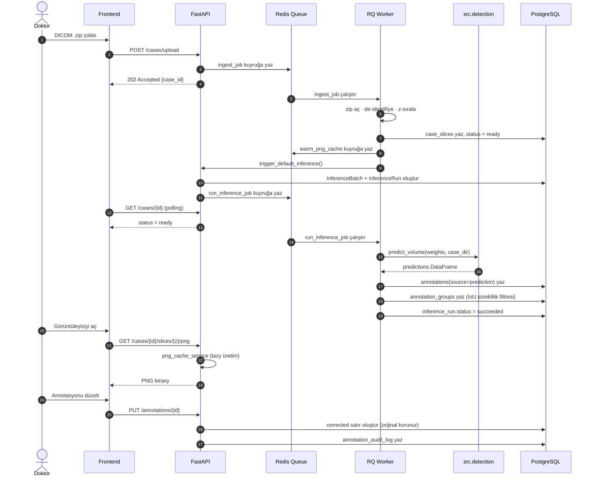
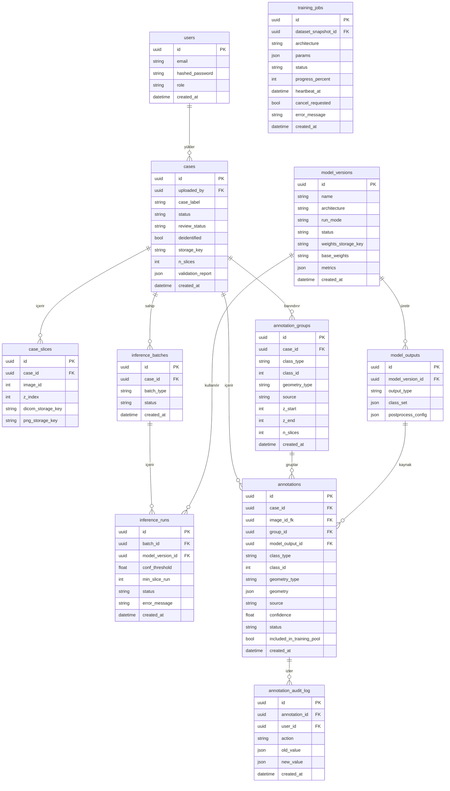
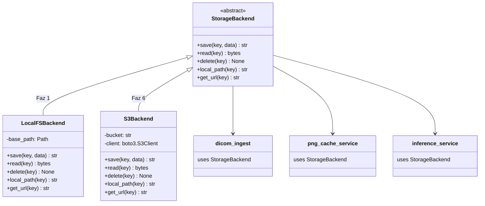

# AbdomenDetect — Sistem Mimarisi

> Bu diyagramlar Mermaid.js ile çizilmiştir.
> GitHub, Obsidian, MkDocs ve Notion tarafından doğrudan render edilir.
> PDF ihracat için `mmdc -i architecture.md -o architecture.pdf` kullanın (`@mermaid-js/mermaid-cli`).

---

## 1. Genel Sistem Mimarisi

```mermaid
graph TB
    subgraph CLIENT["🖥️  İstemci (Tarayıcı)"]
        UI_Login["Giriş\n(JWT)"]
        UI_Worklist["Vaka Listesi\n(Worklist)"]
        UI_Viewer["DICOM Görüntüleyici\n(react-konva)"]
        UI_Admin["Admin Paneli\n(Model Registry)"]
    end

    subgraph FRONTEND["🌐  Frontend — Next.js 14 / TypeScript"]
        FE_Auth["auth.ts\n(JWT decode, role)"]
        FE_Query["@tanstack/react-query\n(polling, cache)"]
        FE_API["api-client.ts\n(fetch wrapper)"]
    end

    subgraph BACKEND["⚙️  Backend — FastAPI (Python 3.11)"]
        API_Auth["/auth"]
        API_Cases["/cases"]
        API_Inference["/inference"]
        API_Annotations["/annotations"]
        API_Models["/models"]
        API_PNG["/cases/{id}/slices/{z}/png"]
    end

    subgraph SERVICES["🔧  Servis Katmanı"]
        SVC_Ingest["dicom_ingest.py\nZip aç · De-ID · z-sırala"]
        SVC_PNG["png_cache_service.py\nLazy on-demand · Warm cache RQ job"]
        SVC_Inference["inference_service.py\npredict_volume sarmalayıcısı"]
        SVC_Annotation["annotation_service.py\nCRUD · correct() · audit log"]
        SVC_Security["security_service.py\nKVKK de-identifikasyon"]
        SVC_Storage["storage_service.py\nStorageBackend soyutlaması"]
    end

    subgraph ML["🧠  ML Katmanı (src/)"]
        ML_YOLO["src.detection\npredict_volume()"]
        ML_SEG["src.yolo_seg\ntrain_yolo_seg()"]
        ML_NNUNET["src.nnunet\nNNUnetPipeline.predict()"]
        ML_OBT["src.organ_bag_transformer\nfcos_forward() + case_forward()"]
    end

    subgraph WORKERS["👷  RQ Workers"]
        W_Ingest["ingest_job\n(de-ID + validation)"]
        W_Inference["run_inference_job\n(MLDependencyUnavailable → failed)"]
        W_PNG["warm_png_cache\n(arka plan ön-ısıtma)"]
        W_Training["training_job\n(heartbeat + cancel)"]
    end

    subgraph STORAGE["💾  Depolama"]
        ST_FS["LocalFSBackend\nwebapp/storage/"]
        ST_DICOM[("DICOM\n.dcm dosyaları")]
        ST_PNG[("PNG önbellek")]
        ST_WEIGHTS[("Model ağırlıkları\n.pt / .onnx")]
    end

    subgraph DATA["🗄️  Veri (PostgreSQL 16)"]
        DB_Cases["cases\ncase_slices"]
        DB_Models["model_versions\nmodel_outputs"]
        DB_Ann["annotations\nannotation_groups"]
        DB_Inference["inference_batches\ninference_runs"]
        DB_Training["training_jobs\ndataset_snapshots"]
        DB_Audit["annotation_audit_log\ndata_access_log"]
    end

    REDIS[("⚡ Redis\nRQ iş kuyruğu")]

    CLIENT --> FRONTEND
    FRONTEND --> BACKEND
    BACKEND --> SERVICES
    SERVICES --> ML
    SERVICES --> WORKERS
    WORKERS --> REDIS
    REDIS --> WORKERS
    SERVICES --> STORAGE
    STORAGE --> ST_FS
    ST_FS --> ST_DICOM & ST_PNG & ST_WEIGHTS
    BACKEND --> DATA

    style CLIENT fill:#0d1825,stroke:#1e3048
    style FRONTEND fill:#0d1825,stroke:#1e3048
    style BACKEND fill:#0d1825,stroke:#1e3048
    style SERVICES fill:#0d1825,stroke:#1e3048
    style ML fill:#0d1825,stroke:#1e3048
    style WORKERS fill:#0d1825,stroke:#1e3048
    style STORAGE fill:#0d1825,stroke:#1e3048
    style DATA fill:#0d1825,stroke:#1e3048
```

---

## 2. İnference Akışı (Faz 2)

---

## 3. Veritabanı Şeması (Ana tablolar)

---

## 4. İnsan-Döngülü Yeniden Eğitim Akışı (Faz 4)

```mermaid
flowchart LR
    A([DICOM Yükleme]) --> B[Ingest Job\nde-ID · z-sort]
    B --> C[Inference\nrun-default]
    C --> D{Doktor\nİncelemesi}

    D -->|Kabul| E[annotation\nincluded_in_training_pool=true]
    D -->|Düzelt| F[corrected annotation\norijinal korunur]
    D -->|Sil| G[soft-delete\naudit log]

    F --> E
    E --> H[review_status → reviewed]
    H --> I{Admin\nQA Kapısı}

    I -->|Onayla| J[approved_for_training]
    I -->|Reddet| K[excluded]

    J --> L[Dataset Snapshot\nDB-native manifest]
    L --> M[make_splits\nfold üretimi]
    M --> N[Training Job\ntrain_yolo / train_yolo_seg]
    N --> O[Heartbeat + Cancel]
    O --> P[Evaluator\nF1 @ IoU]
    P --> Q{Admin\nMetrik onayı}

    Q -->|Aktifleştir| R[model_versions\nstatus=active]
    Q -->|Reddet| S[inactive\narchived]

    R --> C

    style A fill:#0d1825,stroke:#3b82f6
    style R fill:#0d1825,stroke:#34d399
    style K fill:#0d1825,stroke:#f87171
    style S fill:#0d1825,stroke:#f87171
```

---

## 5. Deployment Mimarisi (Docker Compose)

```mermaid
graph TB
    subgraph HOST["🖥️  Docker Host"]
        subgraph NET["abdomen-net (bridge)"]
            FE["frontend\n:3001\nNext.js 14"]
            BE["backend\n:8000\nFastAPI + Uvicorn"]
            WK["worker\nRQ Worker\n(ultralytics)"]
            DB[("db\n:5433\nPostgreSQL 16")]
            RD[("redis\n:6380\nRedis 7")]
        end

        VOL1[("pgdata\npersistent volume")]
        VOL2[("storage\nDICOM · PNG · weights")]
    end

    BROWSER["🌐 Tarayıcı"] --> FE
    FE -->|"API proxy\n/api/v1/*"| BE
    BE -->|"SQLAlchemy"| DB
    BE -->|"rq.Queue"| RD
    WK -->|"rq.Worker"| RD
    WK -->|"SQLAlchemy"| DB
    DB --- VOL1
    BE & WK --- VOL2

    style HOST fill:#07101c,stroke:#1e3048
    style NET fill:#0d1825,stroke:#1e3048
```

---

## 6. StorageBackend Soyutlama Katmanı

---

## 7. Mimari-Bazlı Inference Sarmalayıcıları

| Mimari | `src/` Fonksiyonu | Hazır | Faz |
|---|---|:---:|:---:|
| YOLO Det | `src.detection.predict_volume()` | ✅ | 2 |
| YOLO Seg | `ultralytics.YOLO().predict()` + sarmalayıcı | 🔧 | 2 |
| RF-DETR / D-FINE | yeni sarmalayıcı (Faz3b notebook) | 🔧 | 5 |
| nnU-Net | `NNUnetPipeline.predict()` + `seg_to_bboxes()` | 🔧 | 5 |
| MedNeXt | notebook modülerleştirme | 🔧 | 5 |
| OrganBagTransformer | `fcos_forward()` + `case_forward()` + tensor ön-işleme | 🔧 | 5 |
| Sınıflandırma (timm) | `build_model()` + sigmoid sarmalayıcı | 🔧 | 5 |

> ✅ Hazır · 🔧 Sarmalayıcı gerekiyor · ❌ Kapsam dışı (CT-MAE, nnDetection)
